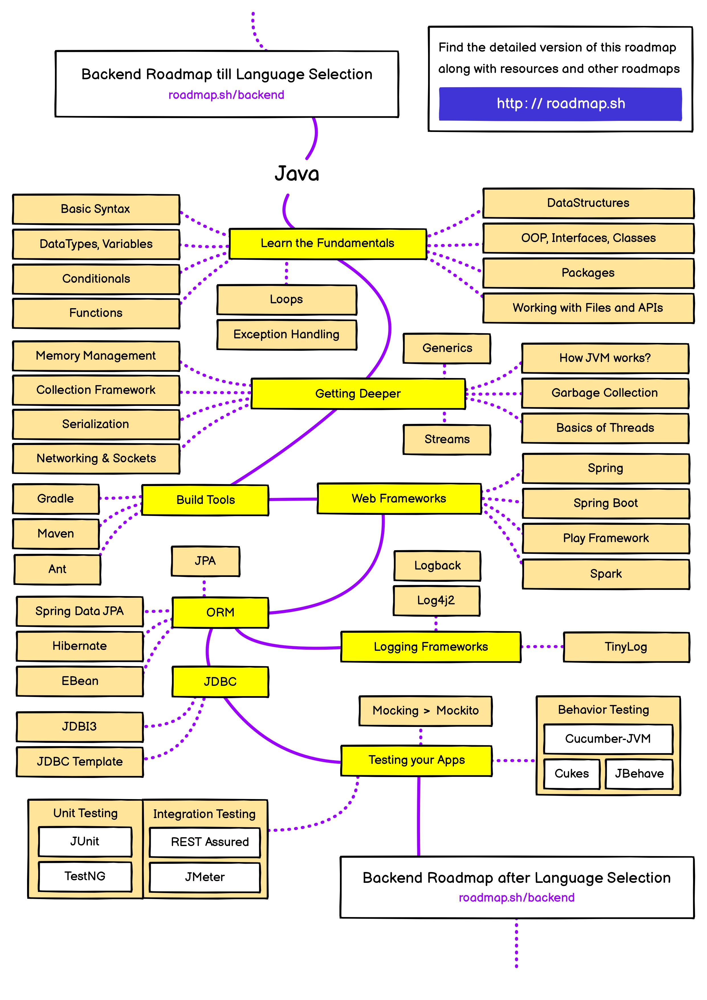

# java-practices

## Roadmap

## Java Editions, Versions, distributions and its Features

Java technology is both a programming language and a platform. 

The Java programming language is a high-level object-oriented language that has a particular syntax and style. 

A Java platform is a particular environment in which Java programming language applications run.

There are several Java platforms. Many developers, even long-time Java programming language developers, do not understand how the different platforms relate to each other.

## The Java Programming Language Platforms

There are four platforms of the Java programming language:

		*	Java Platform, Standard Edition (Java SE)

		*	Java Platform, Enterprise Edition (Java EE)

		*	Java Platform, Micro Edition (Java ME)

		*	Java FX

All Java platforms consist of a Java Virtual Machine (VM) and an application programming interface (API). 

The Java Virtual Machine is a program, for a particular hardware and software platform, that runs Java technology applications. 

An API is a collection of software components that you can use to create other software components or applications. 

Each Java platform provides a virtual machine and an API, and this allows applications written for that platform to run on any compatible system with all the advantages of the Java programming language: 

		*	platform-independence, 

		*	power, 

		*	stability, 

		*	ease-of-development, and 

		*	security.

## Java SE

## Java Development Kit vs Java Run Time

	Sun / Oracle releases of Java SE come in two forms: 

			JRE and JDK. 

	In simple terms, 

			JREs support running Java applications, and 

			JDKs also support Java development.

## Java Runtime Environment

Java Runtime Environment or JRE distributions consist of the set of libraries and tools needed to run and manage Java applications. 

The tools in a typical modern JRE include:

		*	The java command for running a Java program in a JVM (Java Virtual Machine)
		*	The jjs command for running the Nashorn Javascript engine.
		*	The keytool command for manipulating Java keystores.
		*	The policytool command for editing security sandbox security policies.
		*	The pack200 and unpack200 tools for packing and unpacking "pack200" file for web deployment.
		*	The orbd, rmid, rmiregistry and tnameserv commands that support Java CORBA and RMI applications.

"Desktop JRE" installers include a Java plugin suitable for some web browser. This is deliberately left out of "Server JRE" installers.linux syscall read benchmark.

From Java 7 update 6 onwards, JRE installers have included JavaFX (version 2.2 or later).

## Java Development Kit

A Java Development Kit or JDK distribution includes the JRE tools, and additional tools for developing Java software. The additional tools typically include:

		*	The javac command, which compiles Java source code (".java") to bytecode files (".class").

		*	The tools for creating JAR files such as jar and jarsigner

		*	Development tools such as: appletviewer for running applets

		*	idlj the CORBA IDL to Java compiler

		*	javah the JNI stub generator

		*	native2ascii for character set conversion of Java source code

		*	schemagen the Java to XML schema generator (part of JAXB)

		*	serialver generate Java Object Serialization version string.

		*	the wsgen and wsimport support tools for JAX-WS

		*	jdb the basic Java debugger

		*	jmap and jhat for dumping and analysing a Java heap.

		*	jstack for getting a thread stack dump.

		*	javap for examining ".class" files.

		*	jconsole a management console,

		*	jstat, jstatd, jinfo and jps for application monitoring

A typical Sun / Oracle JDK installation also includes a ZIP file with the source code of the Java libraries. Prior to Java 6, this was the only publicly available Java source code.

From Java 6 onwards, the complete source code for OpenJDK is available for download from the OpenJDK site. It is typically not included in (Linux) JDK packages, but is available as a separate package.

## Java SE Versions

	| Version           | Date     | JEPs | Features                                                                                        |
	|-----------------  |----------|------|-------------------------------------------------------------------------------------------------|
	| Java 1.0          | Jan 1996 |      | OS Independant Programming language, Java Virtual Machine                                       |
	| J2SE 5.0          | Sep 2004 |      | Enhanced For Loop, Generics, Enums, Autoboxing                                                  |
	| Java SE 6         | Dec 2006 |      | Scripting Language Support, Improvements to Web Services                                        |
	| Java SE 7         | Jul 2011 |      | Project Coin (Diamond Operator, Strings in Switch), NIO.2                                       |
	| Java SE 8   LTS   | Mar 2014 | 56   | Functional Programming, Lambda & Streams, Multiple Inheritance                                  |
	| Java SE 9         | Sep 2017 | 91   | Modularization - Java Platform Module System                                                    |
	| Java SE 10        | Mar 2018 | 12   | Local Variable Type Inference, List / Set / Map - CopyOf                                        |
	| Java SE 11 LTS    | Sep 2018 | 17   | New HTTP Client API, Nest-based access control, Remove JavaFX                                   |
	| Java SE 12       | Mar 2019 | 8    | Switch Expressions (Preview)                                                                    | 
	| Java SE 13        | Sep 2019 | 5    | Text Blocks (Preview)                                                                           |
	| Java SE 14        | Mar 2020 | 16   | Switch Expressions (Preview in 12 and 13), Pattern Matching for instanceof (Preview)            |
	| Java SE 15        | Sep 2020 | 14   | Text Blocks (Preview in 13), Sealed Classes (Preview), Hidden Classes                           |
	| Java SE 16        | Mar 2021 | 17   | Record Classes (Preview in 14, 15), Pattern Matching for instanceof, Sealed Classes             |
	| Java SE 17 LTS    | Sep 2021 | 14   | Sealed Classes, Pattern Matching for switch (Preview), Enhanced Pseudo-Random Number Generators |
	| Java SE 18        | Mar 2022 | 9    | UTF-8 by default, Simple Web Server, Vector API (Second Incubator)                              |
	| Java SE 19        | Sep 2022 | 7    | Virtual Threads (Preview), Pattern Matching for switch (Third Preview)                          |
	| Java SE 20        | Mar 2023 | 6    | Scoped Values (Incubator), Virtual Threads (Second Preview)                                     |
	| Java SE 21 LTS    | Sep 2023 | 15   | Record Patterns, Unnamed Patterns and Variables, String Templates (Preview)                     |
	| Java SE 22        | Mar 2024 |      | Pattern Matching (Primitives), Stream Gatherers, Vector API                                     |
	| Java SE 23        | Sep 2024 | 12   | Pattern Match (Primitives), Module Import, Simplified Main, Stream Gatherers, Vector API        |

## Compiling and Packaging Our JAR File:

	
	mvn clean package
	
	
	The clean subcommand removes previous artifacts in the target directory, such as the previous stale JAR file

### Screenshots

 

## execute the JAR file by running:

	java -jar /path/to/target/filename.jar
