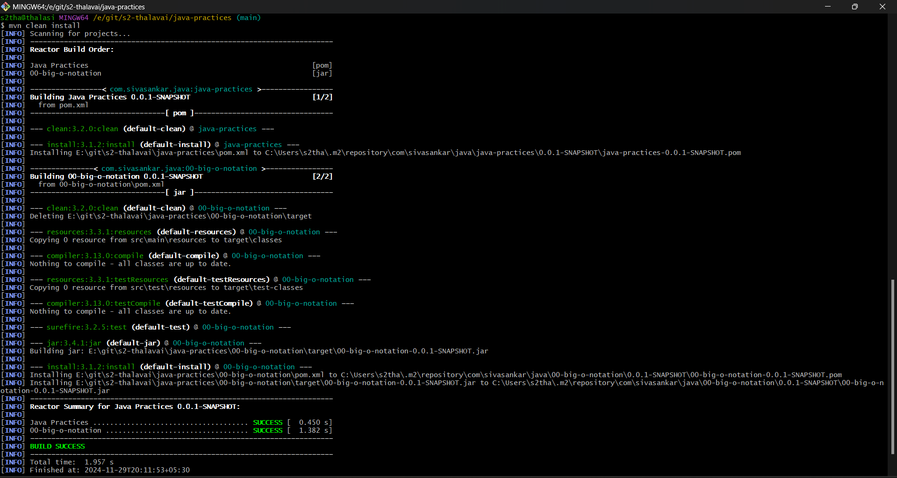

# java-practices

## Java Versions and Features

| Version           | Date     | JEPs | Features                                                                                        |
|-----------------  |----------|------|-------------------------------------------------------------------------------------------------|
| Java 1.0          | Jan 1996 |      | OS Independant Programming language, Java Virtual Machine                                       |
| J2SE 5.0          | Sep 2004 |      | Enhanced For Loop, Generics, Enums, Autoboxing                                                  |
| Java SE 6         | Dec 2006 |      | Scripting Language Support, Improvements to Web Services                                        |
| Java SE 7         | Jul 2011 |      | Project Coin (Diamond Operator, Strings in Switch), NIO.2                                       |
| Java SE 8   LTS   | Mar 2014 | 56   | Functional Programming, Lambda & Streams, Multiple Inheritance                                  |
| Java SE 9         | Sep 2017 | 91   | Modularization - Java Platform Module System                                                    |
| Java SE 10        | Mar 2018 | 12   | Local Variable Type Inference, List / Set / Map - CopyOf                                        |
| Java SE 11 LTS    | Sep 2018 | 17   | New HTTP Client API, Nest-based access control, Remove JavaFX                                   |
 | Java SE 12       | Mar 2019 | 8    | Switch Expressions (Preview)                                                                    | 
| Java SE 13        | Sep 2019 | 5    | Text Blocks (Preview)                                                                           |
| Java SE 14        | Mar 2020 | 16   | Switch Expressions (Preview in 12 and 13), Pattern Matching for instanceof (Preview)            |
| Java SE 15        | Sep 2020 | 14   | Text Blocks (Preview in 13), Sealed Classes (Preview), Hidden Classes                           |
| Java SE 16        | Mar 2021 | 17   | Record Classes (Preview in 14, 15), Pattern Matching for instanceof, Sealed Classes             |
| Java SE 17 LTS    | Sep 2021 | 14   | Sealed Classes, Pattern Matching for switch (Preview), Enhanced Pseudo-Random Number Generators |
| Java SE 18        | Mar 2022 | 9    | UTF-8 by default, Simple Web Server, Vector API (Second Incubator)                              |
| Java SE 19        | Sep 2022 | 7    | Virtual Threads (Preview), Pattern Matching for switch (Third Preview)                          |
| Java SE 20        | Mar 2023 | 6    | Scoped Values (Incubator), Virtual Threads (Second Preview)                                     |
| Java SE 21 LTS    | Sep 2023 | 15   | Record Patterns, Unnamed Patterns and Variables, String Templates (Preview)                     |
| Java SE 22        | Mar 2024 |      | Pattern Matching (Primitives), Stream Gatherers, Vector API                                     |
| Java SE 23        | Sep 2024 | 12   | Pattern Match (Primitives), Module Import, Simplified Main, Stream Gatherers, Vector API        |

## Compiling and Packaging Our JAR File:

	
	mvn clean package
	
	
	The clean subcommand removes previous artifacts in the target directory, such as the previous stale JAR file

### Screenshots
	
 

## execute the JAR file by running:

	java -jar /path/to/target/filename.jar
